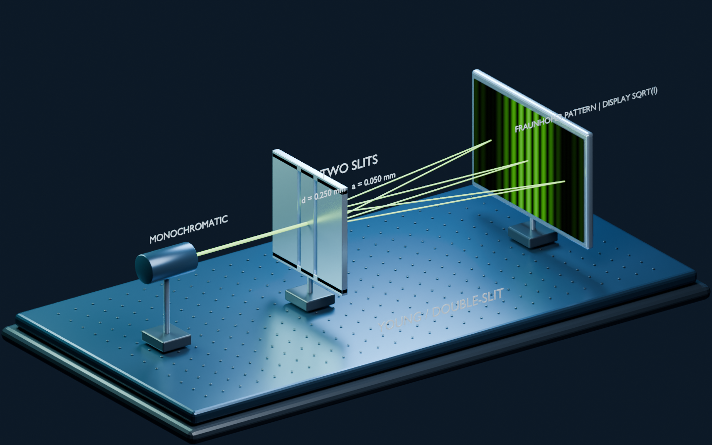

# 光学实验室 · 大学物理交互课件

14 个可调参数光学实验，配套 26 页 PPT / PDF、教师讲义以及 3 个 Blender Cycles 场景。

- 公开仓库：[github.com/banddidonunomarisa741-hub/university-optics-lab](https://github.com/banddidonunomarisa741-hub/university-optics-lab)
- 稳定网页入口：[GitHub Pages](https://banddidonunomarisa741-hub.github.io/university-optics-lab/)
- Netlify：仓库已加入 `netlify.toml`，完成 Netlify 账号授权后可从仓库根目录持续部署。



## 开始使用

从 GitHub 的 **Code → Download ZIP** 下载并解压整个项目，然后双击 **index.html**，即可离线使用，不需要登录或联网。推荐使用电脑浏览器投影；触摸屏和手机也可以调参。

Windows 已安装 Node.js 时，也可以双击 **打开光学课件.cmd**：它会启动本机预览、自动处理端口占用并打开正确地址。不要把旧的 `127.0.0.1:8765` 地址当作固定入口。其他系统在项目文件夹运行 `npm start`，使用终端给出的实际地址；运行课件无需先安装 npm 依赖。

## 交付内容

| 文件 | 用途 |
|---|---|
| `index.html` | 14 个可调参数光学实验的入口 |
| `teaching/optics-lecture.pptx` | 26 页可编辑课堂幻灯片，含备注和实验链接 |
| `teaching/optics-lecture.pdf` | 同版式的投影 / 打印版本 |
| `teaching/teaching-guide.md` | 教学安排、模型约定、例题答案 |
| `blender/optics-lab.blend` | 4 个命名三维场景，含材质、灯光、相机和内嵌计算纹理 |
| `blender/build_scenes.py` | 重建场景及重新渲染的完整脚本 |
| `blender/manifest.json` | Blender 版本、渲染设置、物理参数与限制说明 |
| `assets/renders/` | 3 张 1440 × 900 Cycles 渲染图 |
| `physics.js`、`lesson-content.js` | 独立物理计算模型与可编辑中文讲解 |
| `physics-validation.json` | 数值基准与边界检查记录 |

## 互动操作

1. 左侧选择实验，右侧拖动滑块或直接输入数值；相关图样、曲线和读数一起更新。
2. “空间实验”支持拖动旋转、滚轮缩放。“光路剖面”展示光路或电场轨迹。“Blender 渲染”展示固定装置参考图。
3. 调参时屏幕坐标范围保持不变，便于看出条纹宽度变化；若图样超出画面，点击“适配范围”。空间外形独立按教学尺度放大。
4. “固定对照”保留当前参数的曲线。橙色虚线是对照，蓝色实线是当前结果。涉及两个场分量时紫色虚线表示第二分量。
5. 在曲线上移动指针读取坐标，或“导出数据”获取带参数和单位的 CSV。导出保留 12 位有效数字，显示精度不等于模型或实验的准确度。
6. “保存实验”导出 JSON，在“课件资源”里可恢复。浏览器也会记住每个模块最近的参数。
7. “演示模式”隐藏课程目录和讲义，适合课堂投影。左右方向键切换实验，Esc 退出演示模式。
8. 波动叠加、偏振、波片可播放慢放场演示；双缝和迈克耳孙播放时缓慢扫描相位 / 光程差。其余模块通过调参观察静态关系。

## 内容与模型范围

| 分组 | 实验 | 主要关系 |
|---|---|---|
| 波动基础 | 光波与相位 | 同频场叠加、振幅与平均光强 |
| 几何光学 | 折射与全反射；薄透镜成像 | Snell、Fresnel、临界角、物像关系 |
| 光的干涉 | 双缝；薄膜；牛顿环；迈克耳孙 | 有限缝宽、相干度、多次反射、等厚 / 等倾条纹 |
| 光的衍射 | 单缝；光栅；圆孔与分辨率 | sinc²、有限缝数、缺级、艾里斑、瑞利判据 |
| 偏振光学 | 马吕斯定律；波片 | 二 / 三偏振片、Jones 电场椭圆 |
| 现代光学入门 | 高斯光束；傅里叶光学 | 束腰、瑞利长度、发散、后焦面矩形孔径变换 |

“211”并不是统一的大学物理教学大纲。本版覆盖常见理工科大学物理光学核心与两项拓展，不声称穷尽所有光学问题。厚透镜与像差、真实材料色散、空间双折射分束、旋光、菲涅耳近场、非线性光学和完整电磁场数值求解不在本版范围内。

每个模块都有“模型与来源”。几何光路是示意；屏幕图样与定量曲线调用同一模型。角谱图样采用夫琅禾费近似或透镜后焦面解释，必要时动态提示菲涅耳数超出远场条件。屏幕亮度有视觉映射，曲线数值保持线性。

特别约定：

- 双缝强度以完全相干相长时的 `4Iₛ` 归一化；相干度为零时中央强度为 0.5。
- 牛顿环的反射 / 透射为互补的归一化明暗调制，不应当作绝对能量反射率 / 透射率。
- 迈克耳孙的 `Δ` 是中心双程光程差，单位 μm；`θ` 是观察倾角，不是镜面倾角。
- 圆孔页叠加两个等强非相干点源，强度取两单点艾里函数的平均；重合时中央强度为 1。
- 马吕斯页 `I₀` 定义在第一片之后。非偏振光经过理想第一片还需乘 1/2。
- 波片图以快、慢轴为坐标，使用明确的相位符号约定，不标左右旋以避免观察方向歧义。
- 高斯束半径是 `1/e²` 光强半径；横向曲线按当前截面轴上强度归一化。

## Blender 使用与重建

工程含 `01_Double_Slit`、`02_Refraction_Interface`、`03_Polarization`、`04_Fourier_4f` 四个场景。使用 Blender 的场景选择器切换，相机已布置，可直接查看渲染。第四个场景展示光源、孔径、透镜 1、频谱面滤波片槽、透镜 2 和倒像屏；频谱面与像屏纹理由脚本按解析 Fourier 模型嵌入。

验证环境：Blender 4.5.13 LTS，Cycles CPU，96 采样，降噪，1440 × 900。光线路径和电场形状是放大后的教学标记；Cycles 负责材质与光照，**不计算相干衍射**。双缝观察屏的纹理由脚本中的解析模型计算并嵌入工程，标签明确标为 `DISPLAY SQRT(I)`：渲染亮度是可见度映射，不是线性辐照度。折射场景的光线管径和亮度同样不代表 Fresnel 功率，玻璃材质是视觉近似。

场景自定义属性用于记录参数，不是自动驱动器。需要改变固定渲染内容时，修改 `build_scenes.py` 中相应场景参数并重新运行：

```text
blender --background --python blender/build_scenes.py
```

脚本用自身位置定位课件目录，无固定盘符依赖。仓库包含可编辑的 `.blend` 工程和渲染成品；重新渲染需自行安装 Blender，仓库和分发 ZIP 不包含 Blender 软件本体。每个固定渲染同时输出 1440 × 900 的 WebP（质量 82）和 PNG 回退，网页通过 `<picture>` 优先使用 WebP。

## 检查与重建说明

- 物理检查：`node physics-tests.cjs`。已通过 8,884 个断言，其中 60 个命名数值基准；贝塞尔基准绝对误差阈值为 2×10⁻¹⁰。
- 浏览器检查：14 模块的参数数量、剖面图、三维切换、讲解内容；实测缝距从 0.25 mm 增至 0.50 mm，间距从 3.30 mm 减为 1.65 mm；固定对照、答案、资源对话框与 390 px 手机布局检查通过。
- 幻灯片：使用 PowerPoint 实际渲染全部 26 页并导出 PDF，已检查公式较长页及渲染图页。
- `teaching/build_ppt.js` 使用 Node.js 与 `pptxgenjs`，从同一讲解、公式和默认数值生成幻灯片。需要重建时先运行 `npm ci`，再运行 `npm run build:slides`；生成器使用仓库内 `output/playwright/diagram-*.png` 作为剖面图。PDF 由 PowerPoint 导出，幻灯片重建后需另行导出 PDF。
- 图像与讲义在离线包中可用；参考文献链接访问需要联网。
- 本地预览可选 `node serve.cjs`，只监听本机 `127.0.0.1`。默认使用课件专用端口 `18765`；若端口被占用，会自动选择后续空闲端口，并在终端打印实际地址。`/health` 可用于确认当前地址确实属于本课件。
- Windows 可运行 `powershell -ExecutionPolicy Bypass -File .\start-preview.ps1`；脚本会在隐藏后台进程中启动服务、复用已有的本课件服务，并打开实际预览地址。加 `-NoOpen` 可只启动而不打开浏览器，例如 `powershell -ExecutionPolicy Bypass -File .\start-preview.ps1 -NoOpen`。
- 直接双击 `index.html` 不依赖此服务。

## 参考

- [OpenStax · University Physics Vol. 3](https://openstax.org/books/university-physics-volume-3/pages/1-introduction)
- [MIT OpenCourseWare · Optics 2.71](https://ocw.mit.edu/courses/2-71-optics-spring-2009/resources/lecture-notes/)
- [MIT 8.03SC · Wave Plates](https://ocw.mit.edu/courses/8-03sc-physics-iii-vibrations-and-waves-fall-2016/resources/mit8_03scf16_lec18/)
- [NIST DLMF · Bessel Functions](https://dlmf.nist.gov/10.2)

公式与事实按通行大学物理约定编写，图像、课文和程序为本课件重新制作。Three.js 的许可证随 `vendor/THREE-LICENSE.txt` 提供。
